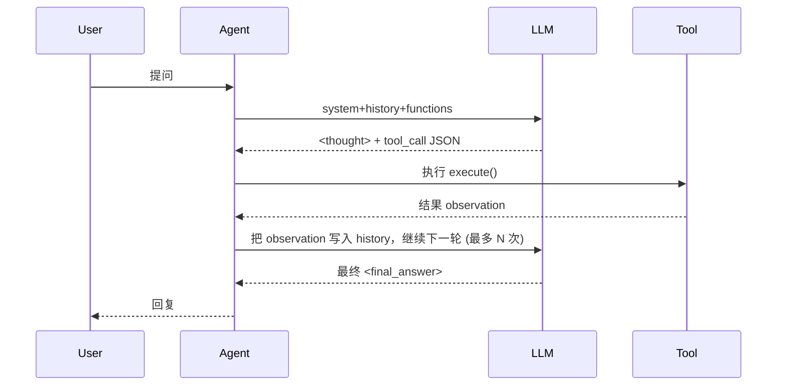

# ReAct Agent 示例项目

> 基于 **ReAct (Reasoning and Acting)** 框架的智能代理系统，通过「思考-行动-观察」循环模式，结合自然语言解析实现工具调用的轻量级 Agent。

---

## ✨ 功能特性

1. **ReAct 思维链**：模型通过思考-行动-观察循环模式解决问题，支持多轮迭代。
2. **原生 Function Calling**：✨ **新增** 使用 OpenAI 标准 Function Calling 协议，让大模型以结构化 JSON 形式触发工具，更加健壮可靠。
3. **工具注册系统**：✨ **新增** 通过 `ToolRegistry` 实现工具解耦，支持装饰器、手动注册、批量注册等多种方式，灵活管理工具。
4. **易扩展工具系统**：只需继承 `BaseTool` 并实现 `execute()`，即可无缝接入新功能（检索、数据库查询、文件操作……）。
5. **可替换 LLM 后端**：当前实现依赖本地 vLLM/OpenAI 兼容接口，修改 `llm_interface.py` 即可接入其他模型服务。
6. **完善的日志系统**：✨ **新增** 基于 Python logging 模块，提供详细的调试信息和错误追踪。
7. **向后兼容**：同时支持新的工具注册方式和旧的直接传入工具列表方式。
8. **CLI 演示**：`python agent/main.py --prompt "问题"` 即可在终端体验完整的思考→调用→回答流程。

---

## 🗂️ 目录结构

```text
agent/
├── core/               # Agent 与工具核心逻辑
│   ├── agent.py        # ReAct Agent 主体
│   └── tools/
│       ├── base.py     # BaseTool 抽象类
│       └── builtin.py  # Calculator / Search / FileOperations 示例工具
├── llm_interface.py    # vLLM(OpenAI 兼容) 调用封装
├── main.py             # CLI 入口
└── README.md           # 项目说明（当前文件）
```

---

## ⚙️ 环境要求

- Python ≥ 3.9
- 已启动的 OpenAI 兼容接口（本地 vLLM / OpenAI / Azure 等）
- 依赖包：`requests`、（如需 vLLM 推理服务自行安装）

> 若你使用 **conda / venv**，可按需创建虚拟环境并安装依赖：
>
> ```bash
> python -m venv .venv && source .venv/bin/activate
> pip install -r requirements.txt   # 如果已提供
> pip install requests             # 示例最小依赖
> ```

---

## 🚀 快速上手

### 1. 安装依赖

```bash
cd /data/clj/Project/ProgrammingStudy/agent
pip install -r requirements.txt
```

### 2. 启动/配置 LLM 服务

默认 `llm_interface.py` 指向 `http://localhost:8000/v1`，请确认你的 vLLM/OpenAI 兼容端点监听在此地址。

### 3. 运行示例

```bash
# 基础示例（使用新的工具注册系统）
python main.py --prompt "计算 3*7+2 的结果" --mode v2

# 使用旧的方式（向后兼容）
python main.py --prompt "计算 3*2-1 的结果" --mode v1

# 启用调试日志
python main.py --prompt "今天天气怎么样？" --debug

# 自定义最大步数
python main.py --prompt "复杂问题" --max_steps 10
```

### 4. 查看工具调用日志

运行过程中，系统会输出详细的日志信息：
- 工具注册情况
- 每轮思考过程
- 工具调用和执行结果
- 错误信息和堆栈

示例输出：
```
2024-11-30 10:00:00 - Agent 初始化完成，已注册 3 个工具: ToolRegistry(tools=['calculator', 'search', 'addFile'])
2024-11-30 10:00:01 - 开始处理用户输入: 计算 3*7+2 的结果
2024-11-30 10:00:02 - 解析到工具调用: calculator({'expression': '3*7+2'})
2024-11-30 10:00:02 - 工具 calculator 执行成功: 3*7+2 = 23
```

---

## 🧩 添加自定义工具

✨ **新版本支持三种注册方式，更加灵活！**

### 方式1: 使用装饰器注册（推荐）

```python
from core.tools.base import BaseTool
from core.tool_registry import tool_registry

@tool_registry.register
class MyTool(BaseTool):
    def __init__(self):
        super().__init__(
            name="myTool",
            description="自定义工具描述",
            parameters={
                "type": "object",
                "properties": {
                    "param": {"type": "string", "description": "示例参数"}
                },
                "required": ["param"],
            },
        )

    def execute(self, param: str):
        return f"你传入了 {param}"
```

### 方式2: 手动注册

```python
from core.tool_registry import ToolRegistry
from core.tools.builtin import Calculator, Search

# 创建注册器
registry = ToolRegistry()

# 单个注册
registry.register_tool(Calculator())

# 批量注册
registry.register_tools([
    Search(),
    MyTool(),
])

# 在 Agent 中使用
agent = Agent(llm=llm, tool_registry=registry)
```

### 方式3: 传统方式（向后兼容）

```python
from core.agent import Agent
from core.tools.builtin import Calculator, MyTool

tools = [Calculator(), MyTool()]
agent = Agent(llm=llm, tools=tools)
```

### 完整示例

查看 `examples/custom_tool_example.py` 获取完整的自定义工具示例代码。

---

## 🏗️ Agent 工作流程



---

## 🔧 常见问题

| 问题 | 可能原因 | 解决方案 |
|------|----------|-----------|
| LLM 返回无 `tool_calls` | Prompt 不正确 / 工具描述不清晰 | 调整 system prompt，引导模型使用工具；补充 `description` 与示例 |
| `Permission denied (publickey)` push 失败 | Git SSH Key 未配置 | 参考本 README 「推送到 GitHub」步骤，添加公钥 |
| 工具执行报错 | 参数类型不匹配 / `execute` 抛异常 | 在 `execute` 内部做类型检查与异常捕获 |

---

## 📄 License

本仓库以 MIT 协议开源，详情见 [LICENSE](LICENSE)。
