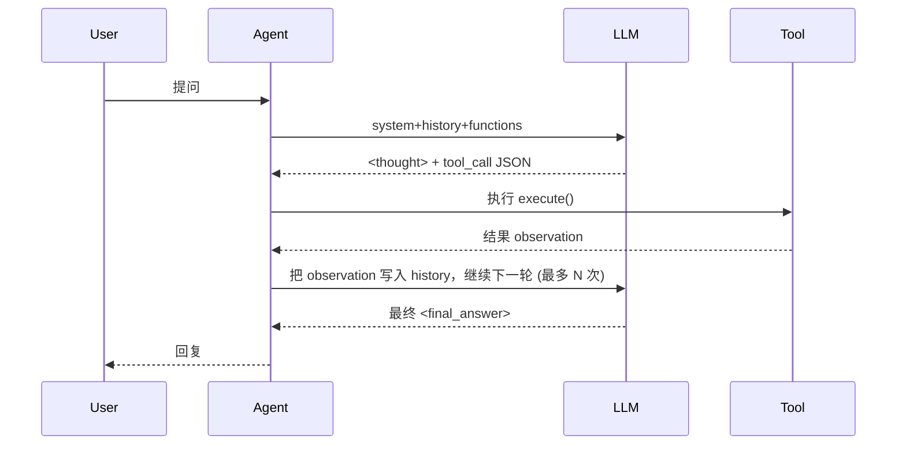

# ReAct Agent 示例项目

> 基于 **ReAct + OpenAI Function Calling** 思想，演示一个支持「思考-行动」循环、可动态调用工具的轻量级 Agent。

---

## ✨ 功能特性

1. **ReAct 思维链**：模型在 `<thought>` 中自我思考，在 `<action>` 中调用工具，在 `<observation>` 中接收反馈，循环迭代直至输出 `<final_answer>`。
2. **函数调用规范**：使用 OpenAI Tools / Function-calling 协议，让大模型以结构化 JSON 形式触发本地 Python 工具。
3. **易扩展工具系统**：只需继承 `BaseTool` 并实现 `execute()`，即可无缝接入新功能（检索、数据库查询、文件操作……）。
4. **可替换 LLM 后端**：当前实现依赖本地 vLLM/OpenAI 兼容接口，修改 `llm_interface.py` 即可接入其他模型服务。
5. **CLI 演示**：`python agent/main.py --prompt "问题"` 即可在终端体验完整的思考→调用→回答流程。

---

## 🗂️ 目录结构

```text
agent/
├── core/               # Agent 与工具核心逻辑
│   ├── agent.py        # ReAct Agent 主体
│   └── tools/
│       ├── base.py     # BaseTool 抽象类
│       └── builtin.py  # Calculator / Search / FileOperations 示例工具
├── llm_interface.py    # vLLM(OpenAI 兼容) 调用封装
├── main.py             # CLI 入口
└── README.md           # 项目说明（当前文件）
```

---

## ⚙️ 环境要求

- Python ≥ 3.9
- 已启动的 OpenAI 兼容接口（本地 vLLM / OpenAI / Azure 等）
- 依赖包：`requests`、（如需 vLLM 推理服务自行安装）

> 若你使用 **conda / venv**，可按需创建虚拟环境并安装依赖：
>
> ```bash
> python -m venv .venv && source .venv/bin/activate
> pip install -r requirements.txt   # 如果已提供
> pip install requests             # 示例最小依赖
> ```

---

## 🚀 快速上手

1. **启动/配置 LLM 服务**  
   默认 `llm_interface.py` 指向 `http://localhost:8000/v1`，请确认你的 vLLM/OpenAI 兼容端点监听在此地址。

2. **运行示例**

```bash
# 进入项目根目录
cd /data/clj/Project/ProgrammingStudy/agent

# 简单算术示例
python main.py --prompt "3*2-1=?"
# 预期输出节选
# <thought>这是一个简单的数学运算问题。</thought>
# ...
# <final_answer>计算结果是5。</final_answer>
```

3. **查看工具调用日志**  
   运行过程中，`agent.core.agent.Agent` 会打印每轮 `messages`、`tools_info`、`tool_calls` 等调试信息，便于理解交互流程。

---

## 🧩 添加自定义工具

1. 在 `core/tools/` 创建新文件或在 `builtin.py` 中新增类，继承 `BaseTool`：

```python
class MyTool(BaseTool):
    def __init__(self):
        super().__init__(
            name="myTool",
            description="自定义工具描述",
            parameters={
                "type": "object",
                "properties": {
                    "param": {"type": "string", "description": "示例参数"}
                },
                "required": ["param"],
            },
        )

    def execute(self, param: str):
        return f"你传入了 {param}"
```

2. 在 `agent/main.py` 的 `build_agent()` 中加入实例：

```python
from core.tools.builtin import Calculator, Search, FileOperations, MyTool

tools = [Calculator(), Search(), FileOperations(), MyTool()]
```

3. 重新运行 CLI，模型即可调用新工具。

---

## 🏗️ Agent 工作流程



---

## 🔧 常见问题

| 问题 | 可能原因 | 解决方案 |
|------|----------|-----------|
| LLM 返回无 `tool_calls` | Prompt 不正确 / 工具描述不清晰 | 调整 system prompt，引导模型使用工具；补充 `description` 与示例 |
| `Permission denied (publickey)` push 失败 | Git SSH Key 未配置 | 参考本 README 「推送到 GitHub」步骤，添加公钥 |
| 工具执行报错 | 参数类型不匹配 / `execute` 抛异常 | 在 `execute` 内部做类型检查与异常捕获 |

---

## 📄 License

本仓库以 MIT 协议开源，详情见 [LICENSE](LICENSE)。
