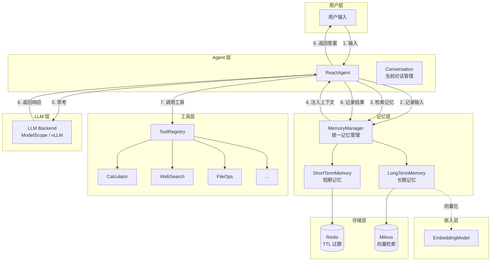
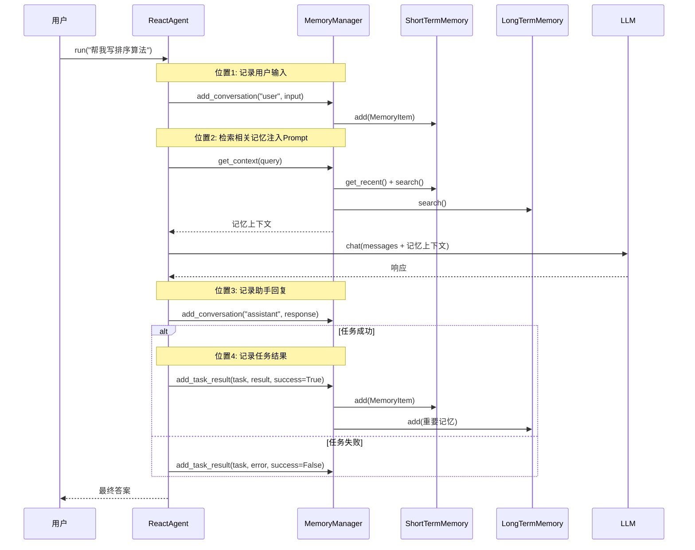
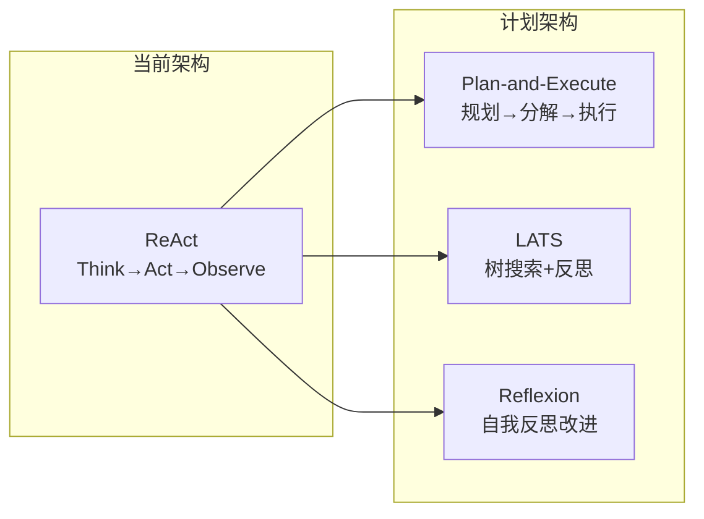
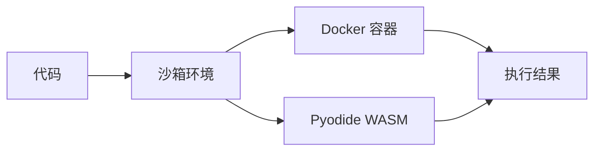
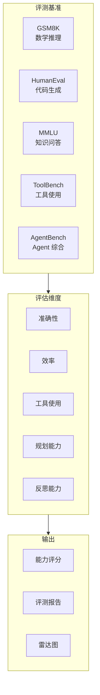
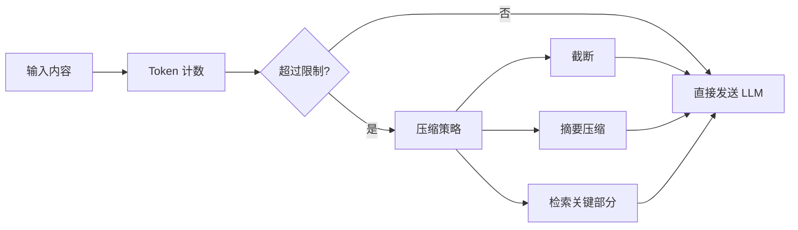
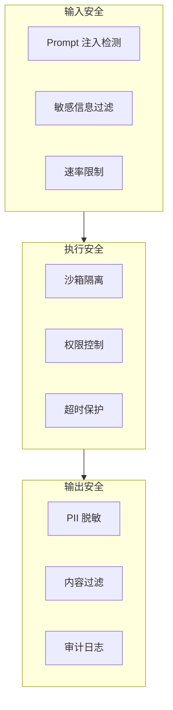

<h1 align="center">Agent Framework</h1>

<p align="center"><b>一个简洁的 AI Agent 学习框架</b></p>

<p align="center">
  <a href="https://python.org"></a>
  <a href="LICENSE"></a>
  <a href="CONTRIBUTING.md"></a>
</p>

<p align="center">
  <a href="#why">Why</a> •
  <a href="#quick-start">Quick Start</a> •
  <a href="#core-concepts">核心概念</a> •
  <a href="#examples">示例</a> •
  <a href="#architecture">架构</a>
</p>

---

## Why

这是一个**面向学习**的 Agent 框架，目标是帮助理解 AI Agent 的核心概念：

- 🧠 **ReAct 模式**：思考 → 行动 → 观察 循环
- 🔧 **工具调用**：LLM 如何使用外部工具
- 🤝 **多 Agent 协作**：专家流水线 vs 动态编排
- 📊 **数据流**：Agent 之间如何传递信息

**不是又一个框架**，而是一个**学习项目**。代码简洁，注释清晰，适合阅读和修改。

---

## Quick Start

```bash
git clone https://github.com/yourname/agent-framework.git
cd agent-framework

pip install -r requirements.txt
export MODELSCOPE_API_KEY="sk-xxx"  # 或用本地 vLLM

# 运行示例
python main.py solo -p "计算 127 * 38"
python main.py solo -p "搜索 Python 是什么"
```

---

## Core Concepts

### 1. ReAct Agent

最基础的 Agent 模式：**思考 → 行动 → 观察 → 思考...**

```python
from agents import ReactAgent
from tools import Calculator, Search

agent = ReactAgent(llm, tools=[Calculator(), Search()])
result = agent.run("北京到上海的距离是多少公里？如果开车时速100公里需要多久？")
```

**执行过程**：
```
用户: 北京到上海的距离是多少公里？如果开车时速100公里需要多久？

Agent 思考: 需要先搜索距离，再计算时间
Agent 行动: search("北京到上海距离")
观察结果: 约1200公里

Agent 思考: 知道距离了，现在计算时间
Agent 行动: calculator("1200 / 100")
观察结果: 12

Agent 回答: 北京到上海约1200公里，时速100公里需要12小时
```

### 2. Tool（工具）

Agent 可以调用的外部能力：

```python
from tools.base import BaseTool

class WeatherTool(BaseTool):
    name = "weather"
    description = "查询城市天气"
    parameters = {
        "type": "object",
        "properties": {
            "city": {"type": "string", "description": "城市名"}
        },
        "required": ["city"]
    }
    
    def execute(self, city: str) -> str:
        # 调用天气 API
        return f"{city}今天晴，25°C"
```

### 3. Agent-as-Tool

把复杂的 Agent 封装成工具，供其他 Agent 调用：

```python
# 专家 Agent
class ContentAgent(BaseLLMAgent):
    """内容优化专家，会进行深度分析和优化"""
    pass

# 封装为工具
class ContentOptimizerTool(BaseTool):
    def execute(self, text: str) -> str:
        agent = ContentAgent(self.llm)
        result = agent.run(text)  # 专家执行 Think-Execute 流程
        return result
```

### 4. Workflow（工作流）

固定顺序的专家流水线：

```python
from workflows.base import BaseWorkflow

class MyWorkflow(BaseWorkflow):
    WORKFLOW_NAME = "my_workflow"
    WORKFLOW_STEPS = ["分析", "处理", "输出"]
    
    def _execute_steps(self, ctx):
        self._step("分析")
        # Step 1 逻辑...
        
        self._step("处理")
        # Step 2 逻辑...
        
        self._step("输出")
        # Step 3 逻辑...
        
        return WorkflowResult(success=True, output={...})
```

### 5. Memory（记忆系统）

Agent 的长短期记忆管理：

```python
from memory import MemoryManager, MemoryType
from agents import ReactAgent

# 创建记忆管理器
memory = MemoryManager(
    redis_host="localhost",      # 短期记忆
    milvus_host="localhost",     # 长期记忆
    embedding=your_embedding,    # 向量模型（长期记忆需要）
    long_term_threshold=0.6,     # 重要性阈值
)

# 集成到 Agent
agent = ReactAgent(
    llm=llm,
    tools=[...],
    memory=memory,  # 启用记忆
)

# Agent 会自动：
# 1. 记录对话到短期记忆
# 2. 重要内容存入长期记忆
# 3. 搜索相关记忆注入 prompt
```

**记忆类型：**

| 类型 | 说明 | 存储位置 |
|------|------|----------|
| `CONVERSATION` | 对话记录 | 短期 |
| `TASK` | 任务执行记录 | 短期/长期 |
| `KNOWLEDGE` | 学到的知识 | 长期 |
| `EXPERIENCE` | 经验总结 | 长期 |
| `USER_PREFERENCE` | 用户偏好 | 长期 |

**Memory 在 Agent 中的使用位置：**

| 位置 | 功能 | 触发时机 |
|------|------|----------|
| `run()` 开始 | 记录用户输入 | 每次对话 |
| `_render_system_prompt()` | 检索记忆注入 Prompt | 每次对话 |
| 每轮对话后 | 记录助手回复 | 每轮 |
| 任务完成时 | 记录成功/失败 | 任务结束 |

---

## Examples

### 示例 1：简单对话

```bash
python main.py solo -p "你好，介绍一下你自己"
```

### 示例 2：工具调用

```bash
python main.py solo -p "计算 (15 + 27) * 3"
python main.py solo -p "搜索 Python 的创始人是谁"
```

### 示例 3：简历生成（完整工作流示例）

这是一个综合示例，展示了多 Agent 协作：

```bash
# Solo 模式 - LLM 自己决定调用顺序
python main.py solo -p "优化简历" --resume @data/sample_resume.json

# Workflow 模式 - 固定专家流水线
python main.py workflow -n resume -i @data/sample_resume.json --jd data/sample_job.txt
```

**流水线架构**：
```
ContentAgent (内容优化)
    ↓ 优化后的数据
StyleSelector (模板选择)
    ↓ 模板配置
LayoutAgent (布局设计)
    ↓ 布局配置
LayoutOptimizer (分页优化)
    ↓ 调整后的配置
ResumeGenerator (生成文档)
    ↓ 
output/*.docx
```

---

## Architecture

### 系统整体架构


```mermaid
flowchart TB
    subgraph UserLayer [用户层]
        User[用户输入]
    end

    subgraph AgentLayer [Agent 层]
        ReactAgent[ReactAgent]
        Conversation[Conversation<br/>当前对话管理]
    end

    subgraph MemoryLayer [记忆层]
        MemoryManager[MemoryManager<br/>统一记忆管理]
        ShortTerm[ShortTermMemory<br/>短期记忆]
        LongTerm[LongTermMemory<br/>长期记忆]
    end

    subgraph StorageLayer [存储层]
        Redis[(Redis<br/>TTL 过期)]
        Milvus[(Milvus<br/>向量检索)]
    end

    subgraph ToolLayer [工具层]
        ToolRegistry[ToolRegistry]
        Calculator[Calculator]
        WebSearch[WebSearch]
        FileOps[FileOps]
        OtherTools[...]
    end

    subgraph LLMLayer [LLM 层]
        LLM[LLM Backend<br/>ModelScope / vLLM]
    end

    subgraph EmbeddingLayer [嵌入层]
        Embedding[EmbeddingModel]
    end

    User -->|1. 输入| ReactAgent
    ReactAgent -->|2. 记录输入| MemoryManager
    ReactAgent -->|3. 检索记忆| MemoryManager
    MemoryManager -->|4. 注入上下文| ReactAgent
    ReactAgent -->|5. 思考| LLM
    LLM -->|6. 返回响应| ReactAgent
    ReactAgent -->|7. 调用工具| ToolRegistry
    ToolRegistry --> Calculator
    ToolRegistry --> WebSearch
    ToolRegistry --> FileOps
    ToolRegistry --> OtherTools
    ReactAgent -->|8. 记录结果| MemoryManager
    ReactAgent -->|9. 返回答案| User

    MemoryManager --> ShortTerm
    MemoryManager --> LongTerm
    ShortTerm --> Redis
    LongTerm --> Milvus
    LongTerm -.->|向量化| Embedding
```

### Memory 使用流程


```mermaid
sequenceDiagram
    participant U as 用户
    participant A as ReactAgent
    participant M as MemoryManager
    participant ST as ShortTermMemory
    participant LT as LongTermMemory
    participant L as LLM

    U->>A: run("帮我写排序算法")
    
    Note over A,M: 位置1: 记录用户输入
    A->>M: add_conversation("user", input)
    M->>ST: add(MemoryItem)
    
    Note over A,M: 位置2: 检索相关记忆注入Prompt
    A->>M: get_context(query)
    M->>ST: get_recent() + search()
    M->>LT: search()
    M-->>A: 记忆上下文
    
    A->>L: chat(messages + 记忆上下文)
    L-->>A: 响应
    
    Note over A,M: 位置3: 记录助手回复
    A->>M: add_conversation("assistant", response)
    
    alt 任务成功
        Note over A,M: 位置4: 记录任务结果
        A->>M: add_task_result(task, result, success=True)
        M->>ST: add(MemoryItem)
        M->>LT: add(重要记忆)
    else 任务失败
        A->>M: add_task_result(task, error, success=False)
    end
    
    A-->>U: 最终答案
```

### 记忆流转示意

```
用户输入 ──┬──► 短期记忆 (Redis) ───► 24小时后过期
           │         │
           │         ▼
           │    重要性 ≥ 0.6?
           │         │
           │        Yes
           │         ▼
           └──► 长期记忆 (Milvus) ───► 永久存储
                     │
                     ▼
              语义向量检索 ◄─── Embedding 模型
```

**层级说明：**

| 层级 | 组件 | 说明 |
|:---:|------|------|
| **入口** | Solo / Workflow | 两种运行模式 |
| **记忆层** | ShortTermMemory, LongTermMemory | 短期(Redis) + 长期(Milvus) |
| **工具层** | Calculator, WebSearch, FileOps | 可调用的能力 |
| **专家层** | ContentAgent, LayoutAgent, ... | 封装为工具的专业 Agent |
| **LLM 层** | ModelScope, vLLM, OpenAI | 大语言模型后端 |
| **存储层** | Redis, Milvus | 记忆持久化存储 |

<details>
<summary><b>目录结构</b></summary>

```
agent/
├── agents/                    # Agent 实现
│   ├── base.py               #   BaseLLMAgent 基类
│   ├── react_agent.py        #   ReAct Agent（集成 Memory）
│   └── crews/                #   专家 Agent
│       └── resume/           #     简历相关（示例）
│
├── memory/                    # 记忆系统 ⭐ NEW
│   ├── base.py               #   MemoryItem, MemoryType 定义
│   ├── short_term.py         #   短期记忆（Redis）
│   ├── long_term.py          #   长期记忆（Milvus 向量）
│   └── manager.py            #   MemoryManager 统一管理
│
├── tools/                     # 工具集
│   ├── base.py               #   BaseTool 基类
│   ├── builtin/              #   内置工具
│   │   ├── calculator.py     #     计算器
│   │   ├── search.py         #     搜索（离线演示）
│   │   ├── web_search.py     #     联网搜索 ⭐ NEW
│   │   └── file_ops.py       #     文件操作
│   ├── agent_wrappers/       #   Agent 工具包装
│   ├── generators/           #   生成器（示例）
│   └── templates/            #   模板系统（示例）
│
├── workflows/                 # 工作流
│   ├── base.py               #   工作流基类
│   └── resume_pipeline.py    #   简历流水线（示例）
│
├── llm/                       # LLM 后端
│   ├── base.py               #   BaseLLM
│   ├── modelscope.py         #   ModelScope
│   └── vllm.py               #   本地 vLLM
│
├── core/                      # 核心组件
│   ├── parser.py             #   工具调用解析
│   ├── message.py            #   消息管理
│   └── task.py               #   任务定义
│
├── prompts/                   # Prompt 模板
├── tests/                     # 测试
└── main.py                    # CLI 入口
```

</details>

---

## 学习路径

建议按以下顺序阅读代码：

### Level 1: 基础概念
1. `tools/base.py` - 理解工具抽象
2. `tools/builtin/calculator.py` - 最简单的工具实现
3. `agents/react_agent.py` - ReAct 循环实现

### Level 2: Agent 设计
4. `agents/base.py` - Think-Execute 模式
5. `agents/crews/resume/content_agent.py` - 专家 Agent 示例
6. `tools/agent_wrappers/` - Agent-as-Tool 模式

### Level 3: 记忆系统
7. `memory/base.py` - 记忆数据结构定义
8. `memory/short_term.py` - Redis 短期记忆
9. `memory/long_term.py` - Milvus 向量长期记忆
10. `memory/manager.py` - 统一记忆管理

### Level 4: 工作流
11. `workflows/base.py` - 工作流基类
12. `workflows/resume_pipeline.py` - 完整工作流示例

### Level 5: 扩展
13. 添加自己的工具
14. 添加自己的 Agent
15. 添加自己的工作流

---

## 动手实践

### 练习 1：添加一个天气工具

```python
# tools/builtin/weather.py
class WeatherTool(BaseTool):
    name = "weather"
    description = "查询城市天气"
    # 实现 execute 方法...
```

### 练习 2：创建一个翻译 Agent

```python
# agents/translate_agent.py
class TranslateAgent(BaseLLMAgent):
    AGENT_NAME = "translator"
    # 实现翻译逻辑...
```

### 练习 3：设计一个新的工作流

```python
# workflows/my_pipeline.py
class MyPipeline(BaseWorkflow):
    # 定义你的处理流程...
```

---

## FAQ

<details>
<summary><b>Solo 模式和 Workflow 模式有什么区别？</b></summary>

| Solo 模式 | Workflow 模式 |
|----------|---------------|
| LLM 自己决定调用哪个工具 | 代码固定执行顺序 |
| 灵活但可能不稳定 | 稳定可控 |
| 适合探索性任务 | 适合生产环境 |

</details>

<details>
<summary><b>为什么用临时文件传递数据？</b></summary>

避免 LLM 传递长 JSON 时出错。使用 `@original`、`@optimized` 等标签引用文件，LLM 只需要传递标签名。

</details>

<details>
<summary><b>如何使用本地 LLM？</b></summary>

```bash
# 启动 vLLM 服务
python -m vllm.entrypoints.openai.api_server --model Qwen/Qwen2-7B-Instruct

# 使用 --local 参数
python main.py solo -p "你好" --local
```

</details>

---

## Roadmap

### 已完成 ✅

| Feature | Description |
|---------|-------------|
| ReAct Agent | 基础 Agent 实现（思考→行动→观察） |
| Tool System | 工具注册、调用、参数解析 |
| Workflow | 专家流水线架构 |
| Resume Example | 完整的多 Agent 协作示例 |
| **Web Search** | 联网搜索（DuckDuckGo / Tavily） |
| **Memory** | 短期记忆(Redis) + 长期记忆(Milvus) |

---

### 下一步：Agent 架构升级 🏗️

计划实现更多 Agent 架构模式：


```mermaid
flowchart LR
    subgraph CurrentArch [当前架构]
        ReAct[ReAct<br/>Think→Act→Observe]
    end
    
    subgraph PlannedArch [计划架构]
        PlanExec[Plan-and-Execute<br/>规划→分解→执行]
        LATS[LATS<br/>树搜索+反思]
        Reflexion[Reflexion<br/>自我反思改进]
    end
    
    ReAct --> PlanExec
    ReAct --> LATS
    ReAct --> Reflexion
```

| 架构 | 描述 | 适用场景 | Priority |
|------|------|----------|:--------:|
| **Plan-and-Execute** | 先规划任务分解，再逐步执行 | 复杂多步骤任务 | ⭐⭐⭐ |
| **LATS** | Language Agent Tree Search，树搜索+反思 | 需要探索多种方案 | ⭐⭐⭐ |
| **Reflexion** | 执行后自我反思，迭代改进 | 需要高质量输出 | ⭐⭐ |
| **AutoGPT-style** | 自主目标分解和执行 | 开放式任务 | ⭐⭐ |

**Plan-and-Execute 架构示意：**

```
用户目标: "帮我写一个博客网站"
        ↓
    [Planner Agent]
        ↓
    任务分解:
    ├── 1. 设计数据库模型
    ├── 2. 实现后端 API
    ├── 3. 创建前端页面
    └── 4. 部署配置
        ↓
    [Executor Agent] × N
        ↓
    逐个执行 + 状态更新
        ↓
    完成
```

---

### 下一步：Skills 工具扩展 🔧

| Skill | Description | Priority |
|-------|-------------|:--------:|
| **Code Executor** | 代码执行沙箱（Docker/Pyodide） | ⭐⭐⭐ |
| **Image Analysis** | 图像理解（多模态 VLM） | ⭐⭐⭐ |
| File Manager | 文件读写、目录操作 | ⭐⭐ |
| Web Browser | 网页浏览和提取 | ⭐⭐ |
| Database | SQL/向量数据库操作 | ⭐⭐ |

#### Code Executor 设计

安全的代码执行沙箱，支持：

```python
class CodeExecutor(BaseTool):
    """代码执行沙箱"""
    
    def execute(self, code: str, language: str = "python") -> str:
        # 方案1: Docker 隔离执行
        # 方案2: Pyodide (浏览器端 Python)
        # 方案3: RestrictedPython (受限执行)
        pass
```


```mermaid
flowchart LR
    Code[代码] --> Sandbox[沙箱环境]
    Sandbox --> Docker[Docker 容器]
    Sandbox --> Pyodide[Pyodide WASM]
    Docker --> Result[执行结果]
    Pyodide --> Result
```

#### Image Analysis 设计

多模态图像理解能力：

```python
class ImageAnalyzer(BaseTool):
    """图像分析工具（多模态）"""
    
    def execute(self, image_path: str, question: str) -> str:
        # 支持的 VLM 后端:
        # - Qwen-VL / Qwen2-VL
        # - LLaVA
        # - GPT-4V / Claude Vision
        pass
```

支持场景：
- 图像描述和问答
- OCR 文字提取
- 图表/流程图理解
- UI 截图分析

---

### 下一步：Agent 能力评估 📊

基于基准测试的能力评分体系：


```mermaid
flowchart TB
    subgraph Benchmarks [评测基准]
        GSM8K[GSM8K<br/>数学推理]
        HumanEval[HumanEval<br/>代码生成]
        MMLU[MMLU<br/>知识问答]
        ToolBench[ToolBench<br/>工具使用]
        AgentBench[AgentBench<br/>Agent 综合]
    end
    
    subgraph Metrics [评估维度]
        Accuracy[准确性]
        Efficiency[效率]
        ToolUse[工具使用]
        Planning[规划能力]
        Reflection[反思能力]
    end
    
    subgraph Output [输出]
        Score[能力评分]
        Report[评测报告]
        Radar[雷达图]
    end
    
    Benchmarks --> Metrics
    Metrics --> Output
```

**评估维度：**

| 维度 | 评测方法 | 基准数据集 |
|------|----------|------------|
| 推理能力 | 数学/逻辑题正确率 | GSM8K, MATH |
| 代码能力 | 代码生成通过率 | HumanEval, MBPP |
| 工具使用 | 工具调用准确率 | ToolBench |
| 规划能力 | 任务分解合理性 | AgentBench |
| 反思能力 | 错误修正率 | Self-Refine |

**输出示例：**

```
┌─────────────────────────────────┐
│     Agent 能力评估报告          │
├─────────────────────────────────┤
│ 推理能力    ████████░░  80%    │
│ 代码能力    ███████░░░  70%    │
│ 工具使用    █████████░  90%    │
│ 规划能力    ██████░░░░  60%    │
│ 反思能力    ███████░░░  70%    │
├─────────────────────────────────┤
│ 综合评分: 74/100               │
└─────────────────────────────────┘
```

---

### 下一步：上下文管理 📏

处理 LLM 上下文窗口限制的核心问题：


```mermaid
flowchart LR
    Input[输入内容] --> TokenCount[Token 计数]
    TokenCount --> Check{超过限制?}
    Check -->|否| LLM[直接发送 LLM]
    Check -->|是| Strategy[压缩策略]
    Strategy --> Truncate[截断]
    Strategy --> Summarize[摘要压缩]
    Strategy --> Retrieve[检索关键部分]
    Truncate --> LLM
    Summarize --> LLM
    Retrieve --> LLM
```

#### 上下文截断检测

```python
class ContextManager:
    """上下文管理器"""
    
    def __init__(self, max_tokens: int = 4096, model: str = "gpt-3.5"):
        self.max_tokens = max_tokens
        self.tokenizer = get_tokenizer(model)
    
    def check_overflow(self, messages: List[dict]) -> dict:
        """检测上下文是否会被截断"""
        total_tokens = self.count_tokens(messages)
        return {
            "total_tokens": total_tokens,
            "max_tokens": self.max_tokens,
            "overflow": total_tokens > self.max_tokens,
            "overflow_tokens": max(0, total_tokens - self.max_tokens)
        }
    
    def estimate_response_budget(self, messages: List[dict], 
                                  reserve_ratio: float = 0.3) -> int:
        """估算剩余可用于响应的 token 数"""
        used = self.count_tokens(messages)
        reserved = int(self.max_tokens * reserve_ratio)
        return max(0, self.max_tokens - used - reserved)
```

#### 上下文压缩策略

| 策略 | 方法 | 适用场景 | 压缩比 |
|------|------|----------|--------|
| **截断** | 丢弃最旧消息 | 对话历史过长 | 高 |
| **摘要压缩** | LLM 总结历史 | 保留关键信息 | 中 |
| **选择性保留** | 只保留相关上下文 | Memory 检索 | 低 |
| **滑动窗口** | 保持固定窗口大小 | 流式对话 | 中 |

```python
class ContextCompressor:
    """上下文压缩器"""
    
    def compress(self, messages: List[dict], 
                 target_tokens: int,
                 strategy: str = "auto") -> List[dict]:
        """
        压缩消息到目标 token 数
        
        策略:
        - truncate: 截断旧消息
        - summarize: 摘要压缩
        - selective: 保留相关部分
        - auto: 自动选择最佳策略
        """
        pass
    
    def summarize_history(self, messages: List[dict]) -> str:
        """将历史消息压缩为摘要"""
        # 使用 LLM 生成简洁摘要
        pass
```

**压缩流程示意：**

```
原始对话 (8000 tokens)
├── System Prompt (500)
├── 历史消息 1-10 (3000)  ← 压缩为摘要 (300)
├── 历史消息 11-20 (2500) ← 保留关键 (800)
├── 当前消息 (1500)       ← 完整保留
└── 工具结果 (500)        ← 完整保留
        ↓
压缩后 (3600 tokens) ✓ 可以发送
```

---

### 下一步：安全防护 🔒

Agent 执行安全和输入/输出过滤：


```mermaid
flowchart TB
    subgraph Input [输入安全]
        PromptInjection[Prompt 注入检测]
        InputFilter[敏感信息过滤]
        RateLimit[速率限制]
    end
    
    subgraph Execution [执行安全]
        Sandbox[沙箱隔离]
        Permission[权限控制]
        Timeout[超时保护]
    end
    
    subgraph Output [输出安全]
        PIIFilter[PII 脱敏]
        ContentFilter[内容过滤]
        Audit[审计日志]
    end
    
    Input --> Execution --> Output
```

#### 安全模块设计

| 模块 | 功能 | Priority |
|------|------|:--------:|
| **Prompt 注入检测** | 识别恶意 prompt 注入攻击 | ⭐⭐⭐ |
| **执行沙箱** | 代码/命令隔离执行 | ⭐⭐⭐ |
| **权限系统** | 工具调用权限控制 | ⭐⭐ |
| **敏感信息过滤** | 输入/输出 PII 脱敏 | ⭐⭐ |
| **审计日志** | 完整操作记录 | ⭐⭐ |

```python
class SafetyGuard:
    """安全防护模块"""
    
    def check_prompt_injection(self, text: str) -> dict:
        """
        检测 prompt 注入攻击
        
        检测模式:
        - 指令覆盖: "忽略之前的指令..."
        - 角色扮演: "你现在是一个..."
        - 越狱尝试: "DAN模式..."
        """
        patterns = [
            r"ignore\s+(previous|above|all)\s+instructions",
            r"忽略(之前|以上|所有)的?(指令|规则)",
            r"you\s+are\s+now\s+a",
            r"你现在是",
            # ... more patterns
        ]
        # 返回风险评分和检测结果
        pass
    
    def filter_pii(self, text: str, mode: str = "mask") -> str:
        """
        过滤敏感个人信息
        
        mode: mask(掩码) / remove(移除) / hash(哈希)
        类型: 手机号、邮箱、身份证、银行卡...
        """
        pass
    
    def validate_tool_call(self, tool_name: str, 
                           args: dict,
                           user_permissions: List[str]) -> bool:
        """验证工具调用权限"""
        pass

class ExecutionSandbox:
    """执行沙箱"""
    
    def __init__(self, 
                 timeout: int = 30,
                 max_memory: str = "512M",
                 network: bool = False):
        self.timeout = timeout
        self.max_memory = max_memory
        self.network = network
    
    def run(self, code: str, language: str = "python") -> dict:
        """
        在沙箱中执行代码
        
        返回: {
            "success": bool,
            "output": str,
            "error": str,
            "execution_time": float,
            "memory_used": int
        }
        """
        # Docker / gVisor / Pyodide 隔离执行
        pass
```

**权限模型：**

```
┌─────────────────────────────────────────┐
│            Permission Levels            │
├─────────────────────────────────────────┤
│ Level 0: Read-Only                      │
│   └── 搜索、查询、分析                   │
│                                         │
│ Level 1: Basic Write                    │
│   └── 文件创建、简单修改                 │
│                                         │
│ Level 2: System Access                  │
│   └── 命令执行、网络访问                 │
│                                         │
│ Level 3: Admin (需人工确认)             │
│   └── 删除、敏感操作                     │
└─────────────────────────────────────────┘
```

---

### 规划中 🚧

| Feature | Description | Priority |
|---------|-------------|:--------:|
| Multi-Agent | 动态编排，Agent 自主协作 | ⭐⭐⭐ |
| RAG | 文档检索增强生成 | ⭐⭐ |
| Web UI | 交互面板、执行可视化 | ⭐⭐ |
| Agent Training | 基于反馈的 Agent 微调 | ⭐ |

---

## Contributing

欢迎贡献代码、示例或文档！

```bash
git checkout -b feat/xxx
python -m pytest tests/ -v
git commit -m "feat: xxx"
```

详见 [CONTRIBUTING.md](CONTRIBUTING.md)

---

<div align="center">

**[MIT License](LICENSE)**

<sub>Made for learning. Keep it simple.</sub>

</div>
